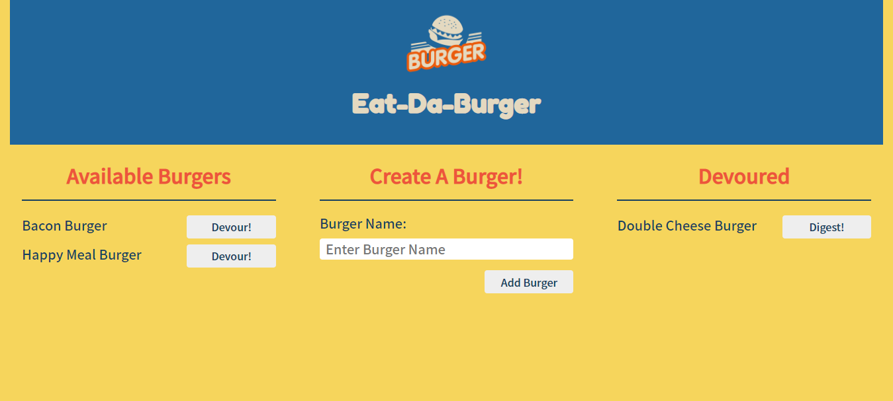

# Eat-Da-Burger - MVC Design Pattern

## Table of Contents

  * **[Description](#Description)**  
  * **[Installation Requirements](#Installation-Requirements)**  
  * **[Usage](#Usage)**  
  * **[License](#License)**    
  * **[Contributors](#Contributors)**  
  * **[Tests](#Tests)**  
  * **[Questions](#Questions)** 

# Description

This is a burger logger using MySQL, Node, Express, Handlebars and a homemade ORM.  The development architecture follows the MVC (Model View Controller) design pattern. Using Node and MySQL, we query and route data in the app and Handlebars to generate the HTML.

* Eat-Da-Burger! is a restaurant app that lets users input the names of burgers they'd like to eat.

* Whenever a user submits a burger's name, your app will display the burger on the left side of the page -- waiting to be devoured.

* Each burger in the waiting area also has a `Devour it!` button. When the user clicks it, the burger will move to the right side of the page.

* The app will store every burger in a database, whether devoured or not.

# Installation Requirements

Express: 
http://expressjs.com/
    
MySql: 
https://www.npmjs.com/package/mysql#install
    
Handlebars: 
https://www.npmjs.com/package/express-handlebars

# License 

none

# Have Questions?

## [Github Profile: github.com/jardseefried](https://github.com/jardseefried "Title")

Please email me at jared.seefried@yahoo.com if you have additional questions. 